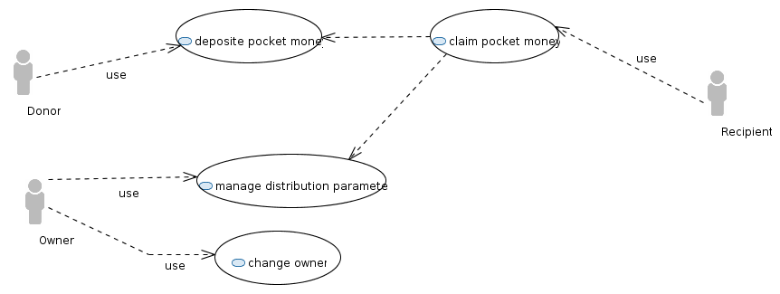
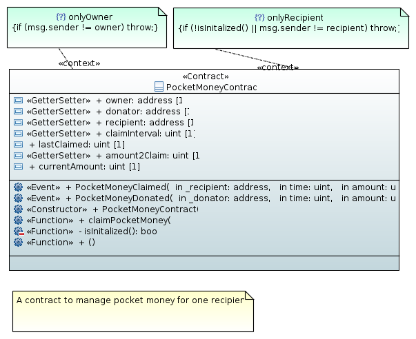

## pocket money contract

A contract to manage pocket money for one recipient.


 

|Actor name|use cases|doc|
|---|---|---|
|Recipient|claim pocket money|The recipient is the one able to claim and withdraw the money.|
|Donor|deposit pocket money|The donor is the one providing the money.|
|Owner|change owner, manage distribution parameter|The owner is per default the creator of the contract and responsible for managing it.|

[details](doc/pocketMoney-usecases.md)



```
contract: PocketMoneyContract
constructor PocketMoneyContract()
function claimPocketMoney() public  onlyRecipient() 
function isInitalized() private  returns (bool )
function () public  payable 
```
 
[details](doc/contracts.md)

### commandline

A simple command line tool to deploy and manage the contract. See [pocketMoneyContract.conf](etc/pocketMoneyContract.conf) and [pocketMoneyContract.sh](etc/pocketMoneyContract.sh) for details. Need bash and java.

```
usage: pockeMoneyContract.sh -c <address> | -d | -l <address> | -p <address,wei> | -s <amount2claim,interval,donator,recipient,address>  [-f <file
       alreadyCompiled>] [-h]  [-millis <millisec>]   [-sk <keyFile>] [-sp <password>] [-wca <filename>]

A contract to manage pocket money for one recipent (c) Urs Zeidler 2017
 -c,--claim <address>                                         Claim the money.
 -d,--deploy                                                  Deploys the contract.
 -f,--file <file alreadyCompiled>                             Set the contract source or the compiled json.
 -h                                                           show help and usage
 -l,--list <address>                                          List the contract properties.
 -millis <millisec>                                           The millisec to wait between checking the action.
 -p,--pay <address,wei>                                       Pay in wei.
 -s,--set <amount2claim,interval,donator,recipient,address>   Set contract parameters.
 -sk,--senderKey <keyFile>                                    Set the sender key file.
 -sp,--senderPass <password>                                  Set the pass of the key of the sender.
 -wca,--writeContractAddress <filename>                       Write contract to file.
```
 