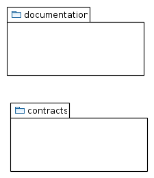

## pocket money contract

A contract to manage pocket money for one recipient.


 

|Actor name|use cases|doc|
|---|---|---|
|Recipient|claim pocket money|The recipient is the one able to claim and withdraw the money.|
|Donor|deposit pocket money|The donor is the one providing the money.|
|Owner|change owner, manage distribution parameter|The owner is per default the creator of the contract and responsible for managing it.|

[details](doc/pocketMoney-usecases.md)



 
[details](doc/ClassDiagram.md)

### commandline

```
usage: pockeMoneyContract.sh -c <address> | -d <arg> | -l <address> | -p <wei>  [-f <file alreadyCompiled>] [-h]  [-millis <millisec>]  [-sk
       <keyFile>] [-sp <password>]

A contract to manage pocket money for one recipent (c) Urs Zeidler 2017

 -c <address>                       Claim the money.
 -d <arg>                           Deploys the contract.
 -f,--file <file alreadyCompiled>   Set the contract source or the compiled json.
 -h                                 show help and usage
 -l <address>                       List the contract properties.
 -millis <millisec>                 The millisec to wait between checking the action.
 -p <wei>                           Pay in wei.
 -sk,--senderKey <keyFile>          Set the sender key file.
 -sp,--senderPass <password>        Set the pass of the key of the sender.
```
 